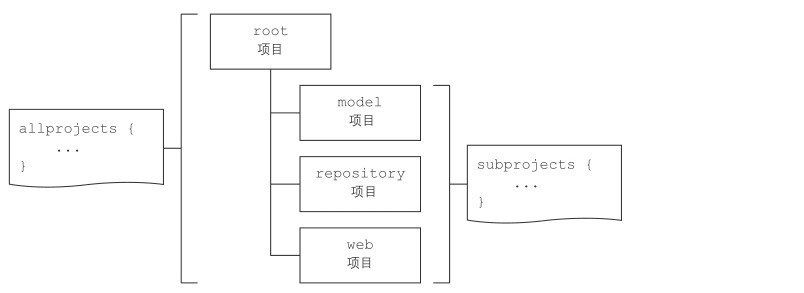

# 多项目构建

项目分模块对于管理和解耦都有帮助，这些模块在 gralde 看来是一个个独立的子项目。

位于工程顶层目录中的项目被称为根项目，它协调构建子项目，并且为子项目定义一些共同的或特定的行为。

gralde 通过根项目中的 `setting.gradle` 来配置项目层次结构。通过 include 导入项目。例如：

```groovy
include ':retrofit'
include ':retrofit:android-test'
```
用 `:` 分割目录层级。 可以使用 `gradle projects` 查看项目结构。

## 构建 gralde

在Gradle组装构建之前，它会创建一个类型为Settings的实例。 接口设置是设置文件的直接表示。 其主要目的是添加应该参与多项目构建的Project实例。 除了组装多项目构建，您还可以在build.gradle脚本中执行所有习惯操作，因为您可以直接访问Gradle和Project界面。 图6.4显示了Settings界面及其关联的相关方法。


可以在 settings.gradle 文件中编码，可以像调用include一样直接调用接口设置的任何方法。setting.gradle 在任何 Project 实例配置之前的初始化阶段执行。如果想要在 build.gradle 文字中访问 setting 实例，`Gradle#settingsEvaluated(Closure)` 是一个好的配置点。它在 project 被实例化后被回调。

## Setting 文件构建的层级？ 6.2.5


## 配置子项目

1. 在一个项目中定义的属性会自动被其子项目继承。

2. 执行某个子项目的 task

```shell
$ gradle <project name>:<task name>

# 如
$ gradle :app:build
```

3. 项目依赖使用 `implementation project(":lib1")`

4. `-a` 或 `--no-rebuild` 选项可以避免检查依赖子子项目是否需要构建而减少构建时间。

5. 运行测试

```
gradle :lib1:buildNeeded
```

6. 投机那和测试依赖的项目来验证代码变化产生的影响。

```
gradle :lib1:buildDependents
```

### 跨项目的 task 依赖

同名 task 的执行顺序。

加入在多个项目中定义了同名的但没有任何依赖的 task，当执行 `gradle <task name>` 的执行时怎样的呢？他们都会执行，根项目级别的 task 总是先执行，子项目的顺序取决于项目名称的字母顺序，跟 setting 中声明的顺序没有任何关系。

控制 task 的顺序就需要定制依赖关系。

```
project(':lib1') {
    task hello(dependsOn: ':model:hello') {

    }
}

```

## 定义公共行为



公共的行为定义在 `allprojets` 和 `subproject` 作用域内。


## 独立的 build 文件

各个子项目除了在根项目中使用 `project('<project name>') {}` 之外，还能在各自文件夹下添加一个 `build.gradle` 来定义各自的行为。


## 自定义项目

默认的构建名字是 `build.gradle`，这在多项目切换时很容易混淆，加入你想要构建脚本的名字更具有含义，有人跟项目的名称关联。例如：


实现的关键是 `setting.gradle` 文件，它跟其他脚本一样，可以实现等多的编码控制。例如，定制构建脚本：


